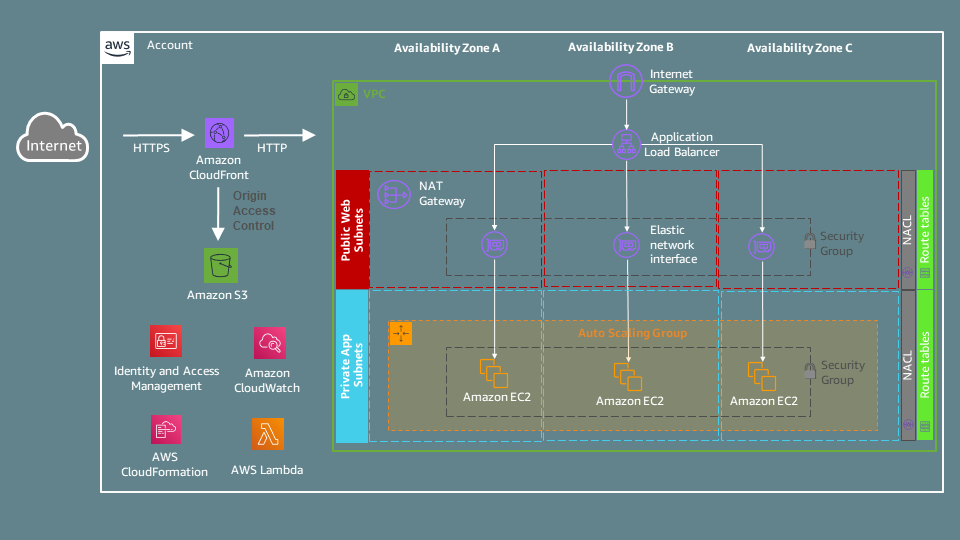

## Overview
This repository demonstrates how to accelerate distribution of your static and dynamic content in a secure, scalable, and repeatable way using [Amazon CloudFront](https://docs.aws.amazon.com/AmazonCloudFront/latest/DeveloperGuide/Introduction.html), [Amazon S3](https://docs.aws.amazon.com/AmazonS3/latest/userguide/Welcome.html), [Amazon EC2](https://docs.aws.amazon.com/AWSEC2/latest/UserGuide/concepts.html), [Application Load Balancer (ALB)](https://docs.aws.amazon.com/elasticloadbalancing/latest/application/introduction.html), [Amazon VPC](https://docs.aws.amazon.com/vpc/latest/userguide/what-is-amazon-vpc.html), and [AWS CloudFormation](https://docs.aws.amazon.com/AWSCloudFormation/latest/UserGuide/Welcome.html). Other AWS services used are [Amazon CloudWatch](https://docs.aws.amazon.com/AmazonCloudWatch/latest/monitoring/WhatIsCloudWatch.html), [AWS Lambda](https://docs.aws.amazon.com/lambda/latest/dg/welcome.html), [AWS IAM](https://docs.aws.amazon.com/IAM/latest/UserGuide/introduction.html), and [AWS SDK for Python (Boto3)](https://aws.amazon.com/sdk-for-python/).

## Architecture
CloudFront is the content delivery network (CDN) used to distribute the content of a single-page application to lower user latency (the time it takes to load the first byte of a web file) and achieve higher data transfer rates. A static webpage is backed by a simple Express.js application that listens to HTTP requests and sends back a JSON response that includes the server timestamp and HTTP headers received in the request. The application content can be divided into two parts: static content hosted on S3 and dynamic content hosted on EC2. The AWS design of this application leverages a set of CloudFront, S3, and EC2 features to achieve high availability, scalability, and security objectives.


## AWS Design
The provided template will launch AWS resources into a VPC which resembles a traditional data center network. EC2 instances are associated with an EC2 Auto Scaling to maintain application availability by checking the health of the application nodes (fleet management) and responding to changes in demand (dynamic scaling). An ALB is used to automatically distribute incoming traffic across multiple EC2 instances. S3 is the object storage layer used to store static content. CloudFront global network infrastructure supporting edge termination is used to reach viewers across the globe and optimize web content delivery.



The AWS design includes the following set of features: 
- The CloudFront distribution requires HTTPS for communication between viewers and CloudFront by redirecting all HTTP requests to HTTPS. To avoid information exposure, CloudFront is configured with a custom error response behavior and a default root object, `index.html`. In addition, CloudFront forwards GET and HEAD requests only to origins, since that's all what the application requires, and excludes other HTTP methods, the query string, and any cookies in viewer requests. 
- The S3 bucket is configured with Block Public Access and has its bucket policy restrict to the CloudFront distribution using Origin Access Control.
- The Application Load Balancer is configured across 3 Availability Zones with HTTP-based health check for the target group. The Security Group of the Application Load Balance is restricted to AWS-managed prefix list for Amazon CloudFront using CloudFormation custom resources.
- EC2 Auto Scaling is configured to offer dynamic scaling across 3 Availability Zones, triggering a scale-out or scale-in event when the average CPU utilization of all running instances is higher or lower than 70% over a period of five minutes. The Auto Scaling group size has a minimum size of 3 instances and maximum size of 9 instances. In addition, the Auto Scaling Group uses the Application Load Balancer health check to improve the application availability.
- The EC2 instance type is EC2 M6g.large powered by Arm-based AWS Graviton2 processors which delivers up to 40% better price performance. EC2 user data is used to install and configure Express.js at instance launch time. The EC2 instances will be deployed in private subnets and are not reachable from the Internet. A NAT Gateway is used to connect the EC2 instances to the Internet to install the required software packages. In addition, the EC2 Security Group is restricted to port 80 and the VPC private IP range.

The following features will not be configured by the CloudFormation template provided. However, they are highly recomended for production environments:
- Enable deletion protection and redirection to HTTPS for the Application Load Balancer.
- Enable access logs for CloudFront, S3, and Application Load Balancer; and VPC Flow Logs.
- CloudFront distributions should have AWS WAF enabled and should use custom SSL/TLS certificates.
- Create a NAT Gateway in each Availability Zone to have fault-tolerance against Availability Zone (AZ) failures.

## Deployment
1. Use the provided `cloudformation-template.yaml` file to deploy a CloudFormation stack in your AWS region of choice. Make sure the latest AWS features used in template, such as EC2 M6g instances and CloudFront managed prefix lists, are supported in the selected AWS region.
2. Once the CloudFormation stack is created successfully, click on the **Outputs** tab which enables you to get access to information about resources within the stack.
3. Go to the S3 console to identify the S3 bucket which should store your static content. Upload the files provided in the `content` directory to the S3 bucket.
4. Go to the EC2 console to check if the EC2 instances created by CloudFormation finished initializing and entered the running state.  
5. Click on the CloudFront distribution domain name to access all content of your website. The static content is avaialble under `https://xxxxxxxxxxxx.cloudfront.net/index.html` while the dynamic content is available under `https://xxxxxxxxxxxx.cloudfront.net/api`.  

## Testing
To test if the distribution is ready to be used in your region, you can use the following 'nslookup` command to query the CloudFront distribution domain name and observe how CloudFront returns multiple IP addresses.
```
nslookup xxxxxxxxxxxx.cloudfront.net
```

To check the average round trip time versus time to first byte, you can use the commands below:
- Using Windows command prompt:
```
for /L %i in (1,1,10) do @echo %i && curl -s -o NUL -w "full-load-time: %{time_total} // time-to-first-byte: %{time_starttransfer}\n" https://xxxxxxxxxxxx.cloudfront.net
```
- Using Linux bash shell: 
```
for i in `seq 1 10`; do echo $i; curl -s -o /dev/null -w "full-load-time: %{time_total} // time-to-first-byte: %{time_starttransfer}\n" https://xxxxxxxxxxxx.cloudfront.net; done
```

Browser developer tools, such as [Chrome](https://developer.chrome.com/docs/devtools/network/) and [Firefox](https://firefox-source-docs.mozilla.org/devtools-user/index.html) network panels, offer a developer-friendly way to inspect website latency and understand load performance. The browser developer tools can be combined with enabling [Amazon CloudFront Server Timing headers](https://docs.aws.amazon.com/AmazonCloudFront/latest/DeveloperGuide/understanding-response-headers-policies.html#server-timing-header), which provide detailed performance information, such as whether content was served from cache, how the request was routed, and how much time was observed by CloudFront at each caching stage.

## Cost
The estimated daily cost for running this demonstration application is $7.5 USD. Assuming you be able to take advantage of CloudFront and S3 free usage tiers and Auto Scaling group size will not go above 3 instances, you should expect to pay about $5.5 USD for compute and $2 USD for networking.
