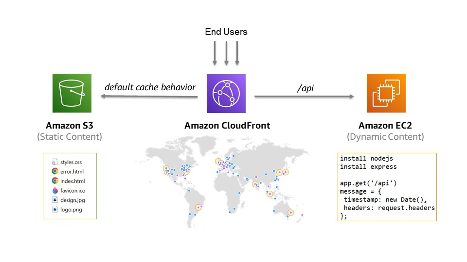

## Overview
This repository demonstrates how to accelerate your static and dynamic web content in a secure, scalable, and repeatable way using Amazon CloudFront, Amazon S3, Amazon EC2, Amazon VPC, and AWS CloudFormation services.

- [What is Amazon CloudFront?](https://docs.aws.amazon.com/AmazonCloudFront/latest/DeveloperGuide/Introduction.html)
- [What is Amazon S3?](https://docs.aws.amazon.com/AmazonS3/latest/userguide/Welcome.html)
- [What is Amazon EC2?](https://docs.aws.amazon.com/AWSEC2/latest/UserGuide/concepts.html)
- [What is Amazon VPC?](https://docs.aws.amazon.com/vpc/latest/userguide/what-is-amazon-vpc.html)
- [What is AWS CloudFormation?](https://docs.aws.amazon.com/AWSCloudFormation/latest/UserGuide/Welcome.html)

## Architecture
All web content is distributed using CloudFront to lower global user latency (the time it takes to load the first byte of the file) and achieve higher data transfer rates. The application content can be divided into two parts: static content hosted on S3 and dynamic content hosted on EC2. The static webpage is backed by a simple Express.js application that listens to HTTP requests and sends back a JSON response that includes the server timestamp and HTTP headers received in the request.



## AWS Design
The AWS design includes the follwing set of features: 
- The CloudFront distribution requires HTTPS for communication between viewers and CloudFront. To avoid information exposure, CloudFront is configured with a custom error response behavior and a default root object, `index.html`. In addition, CloudFront forwards GET and HEAD requests to origins, since that's all what the application requires, but excludes other HTTP methods, the query string, and any cookies in viewer requests. 
- The S3 bucket is configured with Public Access Block and has its bucket policy restrict to Origin Access Identity for CloudFront.
- The Application Load Balancer is configured across 3 Availability Zones with HTTP-based health check for the target group. The Security Group of the Application Load Balance is restricted to AWS-managed prefix list for Amazon CloudFront using CloudFormation custom resources.
- The Auto Scaling Group is configured across 3 Availability Zones with a minimum size of 3 instances and maximum size of 9 instances. The Auto Scaling group triggers scale-out or scale-in event when the average CPU utilization across all running instances is higher or lower than 70% over a period of five minutes. In addition, the Auto Scaling Group uses the Application Load Balancer health check to improve the application availability.
- The EC2 instance type is EC2 M6g.large powered by Arm-based AWS Graviton2 processors which delivers up to 40% better price performance. EC2 user data is used to install and configure Express.js at instance launch time. The EC2 Security Group is restricted to port 80 and private IP address range.


## Deployment
1. Use the provided `cloudformation-template.yaml` file to deploy a CloudFormation stack in your AWS region of choice. Make sure the latest AWS features used in template, such as EC2 M6g instances and CloudFront managed prefix lists, are supported in the selected AWS region.
2. Once the CloudFormation stack is created successfully, click on the **Outputs** tab which enables you to get access to information about resources within the stack.
3. Go to the S3 console to identify the S3 bucket which should store your static content. Upload the files provided in the `content` directory to the S3 bucket.
4. Go to the EC2 console to check if the EC2 instances created by CloudFormation finished initializing and entered the running state.  
5. Click on the CloudFront distribution domain name to access all content of your website. The static content is avaialble under `/index.html` while the dynamic content is available under `/api`.  

## Testing
To test if the distribution is ready to be used in your region, you can use the `nslookup xxxxxxxxxxxx.cloudfront.net` command to lookup the CloudFront distribution domain name. You should be able to observe that CloudFront returns multiple IPs for each DNS query.

To check the average start transfer time of the application endpoint, you can use the commands below:
- Using Windows command prompt:
```
for /L %i in (1,1,10) do @echo %i && curl -s -o NUL --write-out "size_download: %{size_download} // time_total: %{time_total} // time_starttransfer: %{time_starttransfer}\n" https://xxxxxxxxxxxx.cloudfront.net
```
- Using Linux bash shell: 
```
for i in `seq 1 10`; do echo $i; curl -s -o /dev/null --write-out "size_download: %{size_download} // time_total: %{time_total} // time_starttransfer: %{time_starttransfer}\n" https://xxxxxxxxxxxx.cloudfront.net; done
```

## Cost
TDC
